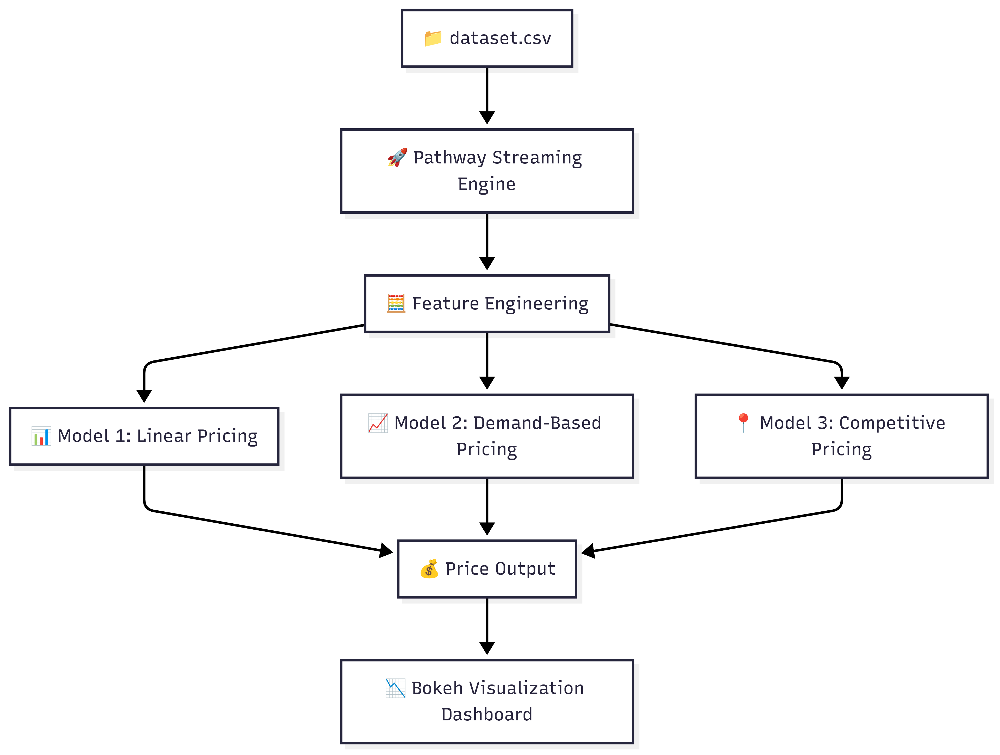

# 🚗 Urban Parking Dynamic Pricing

A real-time dynamic pricing system for 14 urban parking lots based on occupancy, queue length, traffic, vehicle type, and competition. Built as part of **Summer Analytics 2025** by Consulting & Analytics Club × Pathway.

---

## 📦 Tech Stack
- Python (Pandas, NumPy)
- Bokeh (for interactive visualization)
- Pathway (for real-time simulation)
- Mermaid (for architecture diagrams)

---

## 📐 Architecture Diagram

---

## 📁 Folder Structure

